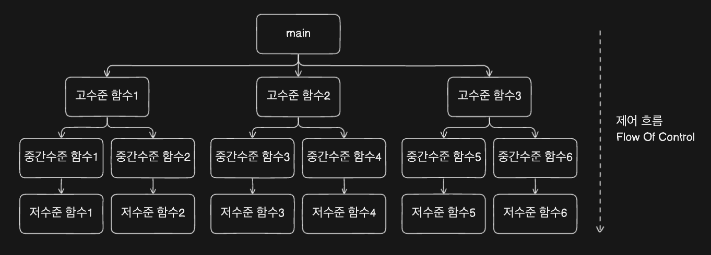
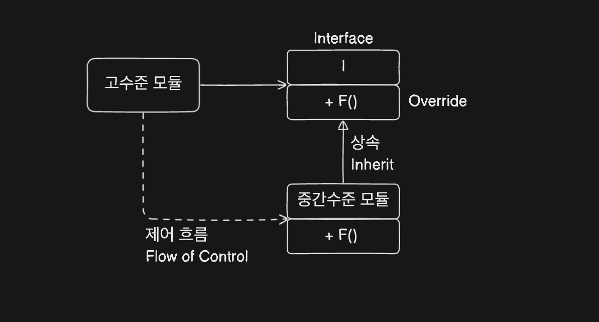
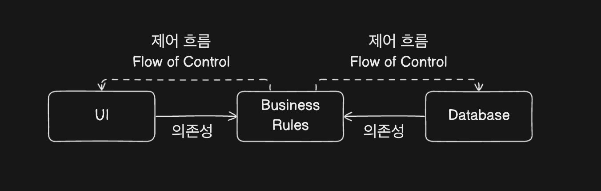

# 2. 객제 지향 프로그래밍 Object Oriented Programming

> 제어 흐름의 간접적인 전환에 대해 규칙을 부과한다

## 1. 객체 지향이란 ?

데이터와 함수의 조합? 실제 세계를 모델링하는 새로운 방법? 캡슐화, 상속, 다형성?

### 1. 캡슐화

-   데이터와 함수를 효과적으로 캡슐화 하는 방법을 객체지향언어가 제공 (private, public ...)
-   객제지향 언어가 아닌 C 에서도 헤더파일과 구현파일의 분리를 통해 완벽한 캡슐화가 가능했음
-   반대로 C++ 에서는 어떤 변수 (데이터) 가 존재한다는것을 알게되고, Java 에서는 헤더와 구현체를 합쳐 캡슐화가 훼손됨
-   객체지향 프로그래밍 언어에서는 캡슐화를 강제하지 않는다

### 2. 상속

-   상속은 `어떤 변수와 함수를 유효 범위로 묶어서 재정의 하는 일` 임
-   자식 클래스를 포함하는 상위집합으로 부모클래스를 재정의 하는것으로 볼수 있음

### 3. 다형성

-   다형성의 정의 : `하나의 객체가 여러가지 타입을 가질 수 있는 것`
-   OOP 에서의 다형성은 Method Overriding, Method Overloading 으로 구현함 <br/><br/>

-   C 에서도 운영체제에 따라 하드웨어 인터페이스를 추상화 하여, 서로 다른 입출력 드라이버에 대해 동작하도록 다형성을 구현하고 있었음
-   플러그인 아키텍쳐 : 이는 입출력 드라이버가 프로그램의 `플러그인` 이 되는것이라고 할 수 있음 (장치 독립적)<br/><br/>

-   의존성 역전 ❗️ - 다형성이 등장하기 이전, main 함수에서 부터 고 - 중 - 저 수준 함수를 호출하는 호출트리를 그리게 됨 - 소스코드의 의존성의 방향은 `제어흐름 flow of control` 을 따름
     - main 또는 고수준함수가 하위 중간수준, 저수준 함수를 호출하기 위해서는 포함된 모듈의 이름을 지정해야함 (#include, import, using) - 이로 인해, 제어흐름은 `시스템의 행위에 따라 결정`되며, `소스 코드의 의존성은 제어흐름에 따라 결정`됨 <br/><br/>

    

    -   고수준 모듈은 Interface I 를 통해 F() 를 호출한다
    -   이 인터페이스는 런타임에는 존재하지 않고, 고수준모듈은 중간수준모듈의 F() 를 간접적으로 호출할 뿐.
    -   `의존성 역전` : 소스코드 의존성 (상속관계)은 제어 흐름과는 반대
    -   `소스코드 의존성은 소스코드 사이에 인터페이스를 추가함으로써 방향을 역전시킬 수 있음` <br/><br/>

    -   예시) 업무 규칙이 데이터베이스와 사용자 인터페이스에 의존하는 대신, 시스템의 소스 코드 의존성을 반대로 배치하여 데이터베이스와 UI 가 업무 규칙에 의존하게 만들 수 있음

    

```java
// 업무 규칙 인터페이스 정의

public interface UserInterface {
    void display(String message);
}

public interface Database {
    void saveData(String data);
}

// 업무 규칙 구현
public class BusinessLogic {
    private UserInterface ui;
    private Database db;
    public BusinessLogic(UserInterface ui, Database db) {
        this.ui = ui;
        this.db = db;
    }
    public void processData(String input) {
        String processedData = "Processed: " + input;
        db.saveData(processedData);
        ui.display("Data saved: " + processedData);
    }
}
// UI 구현
public class ConsoleUI implements UserInterface {
    @Override
    public void display(String message) {
    System.out.println(message);
}
}
// DB 구현
public class FileDatabase implements Database {
    @Override
    public void saveData(String data) {
    // 파일에 데이터 저장 로직
    System.out.println("Data saved to file: " + data);
}
}
// 메인 함수에서 의존성 주입
public class Main {
    public static void main(String[] args) {
    UserInterface ui = new ConsoleUI();
    Database db = new FileDatabase();
    BusinessLogic businessLogic = new BusinessLogic(ui, db);
            businessLogic.processData("Sample Input");
    }
}
```

> #### 1. 전통적인 의존성 구조
>
> -   전통적으로, 시스템은 다음과 같은 의존성 구조를 가집니다:
>
> -   UI와 DB는 업무 규칙에 의해 직접 호출됩니다.
> -   업무 규칙은 UI와 DB에 의존합니다.
> -   이 구조에서는 업무 규칙이 UI나 DB의 변경에 따라 영향을 받게 됩니다.
> -   즉, UI나 DB의 구현이 변경되면 업무 규칙의 코드도 수정해야 할 수 있습니다.
>
> #### 2. 의존성 역전 구조
>
> -   의존성 역전 원칙을 적용하면:
>
> -   업무 규칙은 UI나 DB를 직접 호출하지 않습니다.
> -   대신, UI와 DB는 업무 규칙에 정의된 인터페이스를 구현합니다.
> -   업무 규칙은 인터페이스에만 의존하고, 구체적인 구현은 UI와 DB에서 제공합니다.
> -   이렇게 하면 업무 규칙은 UI나 DB의 구체적인 구현에 의존하지 않게 됩니다. UI와 DB는 업무 규칙에 정의된 인터페이스를 구현하는 '플러그인'처럼 동작합니다.

## 2. 결론

객체지향 프로그래밍이란?

> -   다형성을 이용하여, 전체 시스템의 모든 소스코드 의존성에 대한 절대적인 제어 권한을 획득할 수 있는 능력
> -   객체지향을 이용하여, 플러그인 아키텍쳐를 구성할 수 있고, 이를 통해 고수준의 정책을 포함하는 모듈은 저수준의 세부사항을 포함하는 모듈에 대해 독립성을 보장
> -   저수준의 세부사항은 중요도가 낮은 플러그인 모듈로 개발 할 수 있고, 고수준의 정책을 포함하는 모듈과는 독립적으로 개발하고 배포할 수 있음
